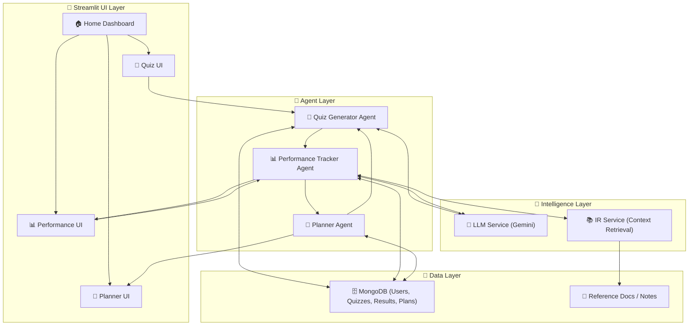

# Adaptive Exam Preparation AI

## 1️⃣ Overview

The goal of this system is to assist students in exam preparation by:

- Planning personalized study schedules  
- Generating quizzes based on knowledge gaps  
- Tracking performance and adapting difficulty  

The system is composed of three AI agents:

| Agent | Role | Core Functions |
|-------|------|----------------|
| **Planner Agent** | Generates personalized study plans based on exam date | Personalized Plans for user preferences |display total study minutes|download personal plan
| **Quiz Generator Agent(LLM Service)** | Creates quizzes based on topics & difficulty | •Generates multiple-choice questions dynamically using the dataset and the Gemini API     •Can generate quizzes of varying difficulty levels depending on the plan from the Planner Agent.|
| **Performance Tracker Agent** | Evaluates student performance, provides feedback, and informs adaptive study plans |• Use performance data to monitor which areas need to be improved.  • Generates AI-based explanations for wrong answers using LLM.   • Identifies weak topics   • Maintains historical performance data in MongoDB.   • Sends performance insights to Planner Agent to adjust upcoming study plans adaptively. |

## 2️⃣ System Architecture

High-Level Flow:

```mermaid

flowchart TD
    %% User Layer
    subgraph UI["🎨 Streamlit UI Layer"]
        UI_Home["🏠 Home Dashboard"]
        UI_Quiz["📝 Quiz UI"]
        UI_Performance["📊 Performance UI"]
        UI_Planner["📅 Planner UI"]
    end

    %% Agent Layer
    subgraph AGENTS["🧩 Agent Layer"]
        C["📝 Quiz Generator Agent"]
        D["📊 Performance Tracker Agent"]
        B["📅 Planner Agent"]
    end

    %% Intelligence Layer
    subgraph AI["🧠 Intelligence Layer"]
        LLM["🤖 LLM Service (Gemini)"]
        IR["📚 IR Service (Context Retrieval)"]
    end

    %% Data Layer
    subgraph DATA["💾 Data Layer"]
        DB["🗄️ MongoDB (Users, Quizzes, Results, Plans)"]
        DOCS["📘 Reference Docs / Notes"]
    end

    %% UI Navigation
    UI_Home --> UI_Quiz
    UI_Home --> UI_Performance
    UI_Home --> UI_Planner

    %% User to Quiz Agent
    UI_Quiz --> C
    UI_Performance --> D

    %% Main Agent Flow
    C --> D
    D --> B
    B --> C

    %% Feedback to UI
    D --> UI_Performance
    B --> UI_Planner

    %% Intelligence integration
    C <--> LLM
    D <--> LLM
    D <--> IR

    %% Data connections
    C <--> DB
    D <--> DB
    B <--> DB
    IR --> DOCS

```
- Planner Agent → Quiz Generator: Planner decides which topics and difficulty level the student should practice and sends this to Quiz Generator to create a tailored quiz.

- Quiz Generator → Performance Tracker: Sends quiz results for evaluation.

- Performance Tracker → Planner Agent: Suggests updates to Study plan based on performance.

- Performance Tracker → Planner → Quiz Generator → Student → Performance Tracker → ...

## 3️⃣ Agent Details & Implementation

### 1. Planner Agent

**Functions:**
- Use performance data to monitor which areas need to be improved. 
- Generate a personalized study plan with resources based on user's performance. (Learn/Practice/Review method)
- Allow users to save a plan once generated, calculate total study time within a plan and mark completion status for each day.
- Provide a plan download option if necessary.
- Sends user performance data to quiz agent

**Tools & Techniques:**
- Python
- Large Language Models (OpenAI API, HuggingFace LLaMA, etc.)
- NLP techniques (optional) for summarization and topic simplification

### 2. Quiz Generator Agent

**Functions:**
- Generate quizzes based on topics or the learner’s weak areas.
- Use NLP to extract key points and important concepts from topics.
- Leverage an LLM to generate multiple-choice or short-answer questions.
- Optionally adapt question difficulty based on user performance.

**Tools & Techniques:**
- Python
- NLP libraries (e.g., spaCy, NLTK) for key point extraction
- LLMs (OpenAI API, HuggingFace LLaMA) for question generation
- Adaptive logic to vary difficulty dynamically

### 3. Performance Tracker Agent

**Functions:**
- Track user answers and quiz scores.
- Analyze strengths and weaknesses across topics.
- Suggest topic revision or adjust quiz difficulty based on performance. (Future update)
- Optionally provide detailed feedback explanations using embeddings + LLM.

**Tools & Techniques:**
- Python
- Simple scoring and analytics logic (Pandas/Numpy)
- Optional: embeddings + LLM for generating personalized feedback
- Streamlit for visualizing performance metrics and progress

## 4️⃣ Communication Between Agents

| Agents | Communication Method | Description / Implementation |
|--------|--------------------|-----------------------------|
| Quiz Generator → Performance Tracker | REST API | Quiz Generator sends user answers and quiz data to Performance Tracker API. Performance Tracker evaluates scores, generates feedback and explanations. |
| Performance Tracker → Planner | REST API | Performance Tracker sends analyzed performance and recommendations to Planner API to update the study plan (adaptive scheduling). |

**Implementation Notes:**
- Each agent runs as a separate FastAPI service with its own endpoints.
- Use JSON payloads for sending data between agents.
- Maintain user session and progress in MongoDB or optionally in st.session_state for frontend continuity.
- Frontend (Streamlit) calls Quiz Generator API for quizzes and Performance Tracker API for results/feedback.
- Planner Agent API is called by Performance Tracker to adapt study plans automatically.

##  5️⃣ Security & Responsible AI

# 🔐 Security Architecture Summary

This document provides an overview of the key security measures implemented in the **Adaptive Exam Preparation AI System** to ensure user data protection, integrity, and controlled access across all system modules.

---

## 🧩 1. Authentication & Session Management

- Implements **session-based authentication** with secure session tokens.  
- Uses **industry-standard password hashing algorithms** for password protection.  
- Supports **login/logout** functionality with session tracking.  
- Manages **session state and timeout** using Streamlit’s session management.  
- Maintains a secure user context across multiple pages.

---

## 🛡️ 2. Input Validation & Sanitization

- Validates **username, password, and email formats** with proper constraints.  
- Enforces **input length limits** to prevent buffer overflow attacks.  
- Filters **special characters** to prevent injection-based attacks.  
- Validates **file uploads** by:
  - Allowing only `.pdf`, `.txt`, `.docx` formats  
  - Restricting size to **10MB**  
- Performs **content sanitization** and secure file handling before processing.

---

## 🔒 3. Data Protection

- **MongoDB connection strings** are encrypted and stored securely.  
- Uses **TLS-secured** database connections for safe communication.  
- Stores **sensitive credentials and API keys** in environment variables.  
- Integrates **Google Gemini API** with key validation and rate limiting.  
- Ensures secure API communication and error handling.

---

## 🚧 4. Access Control

- Implements **subscription-based access** (Free vs Premium tiers).  
- Restricts premium features and enforces quiz limits (10 for free users, 20 for premium).  
- Limits **quiz history** access (last 3 for free users).  
- Applies **role-based and session-based access** validation.  
- Ensures authentication for all protected pages and redirects unauthenticated users to login.

---

## 🌐 5. Network Security

- Uses **localhost binding** for internal service communications.  
- Implements **timeout settings** to prevent hanging requests.  
- Performs **health checks** before initiating API calls.  
- Ready for **production deployment with HTTPS**.  
- Uses **secure cookies** and proper **CORS configuration** for cross-origin safety.

---

## 🔍 6. Error Handling & Logging

- Displays **generic error messages** to avoid information leakage.  
- Maintains **detailed server-side logs** for debugging.  
- Tracks **authentication attempts** and failed logins to detect brute-force attacks.  
- Logs **system and user activities** for security monitoring and compliance.  
- Handles failures gracefully without exposing sensitive details.

---

## 6️⃣ Commercialization Plan

| **Component** | **Details** |
| -------------- | ----------- |
| **Pricing Model** | **Freemium + Subscription**    **• Free Tier:** Users can take quizzes with up to **10 questions per quiz** and view a **limited quiz history** (only the latest 3 quizzes). This tier allows students to explore the platform, test its core features, and stay engaged at no cost. Advanced planner tools and AI-generated explanations are not available in this tier.    **• Premium Tier (500 LKR/month):** Offers up to **20 questions per quiz**, **unlimited quiz history** (view all past quizzes), access to the **AI-powered planner feature** for advanced study scheduling, and **AI-generated explanations** for all questions and answers. Users can review their complete quiz history, including correct answers and responses, ensuring a personalized and continuous learning experience. |
| **Target Users / Market** | **Primary Users:** Undergraduate students preparing for **IT, engineering, and other professional exams** who need structured and adaptive study support to improve performance.    **Secondary Users:** Teachers, tutoring centers, and educational institutions seeking tools to automatically generate quizzes, monitor student performance, and provide personalized learning paths. These users benefit from **AI-driven automation**, scalable student management, and data-based academic insights. |

