# Adaptive Exam Preparation AI

## 1️⃣ Overview

The goal of this system is to assist students in exam preparation by:

- Planning personalized study schedules  
- Generating quizzes based on knowledge gaps  
- Tracking performance and adapting difficulty  

The system is composed of three AI agents:

| Agent | Role | Core Functions |
|-------|------|----------------|
| **Planner Agent** | Generates personalized study plans | Personalized Plans for 7 days, allow study time monitoring and adapts plans based on individual progress|
| **Quiz Generator Agent(LLM Service)** | Creates quizzes based on topics & difficulty | •Generates multiple-choice questions dynamically using the dataset and the Gemini API     •Can generate quizzes of varying difficulty levels depending on the plan from the Planner Agent.|
| **Performance Tracker Agent** | Evaluates student performance, provides feedback, and informs adaptive study plans |• Use performance data to monitor which areas need to be improved.  • Generates AI-based explanations for wrong answers using LLM.   • Identifies weak topics   • Maintains historical performance data in MongoDB.   • Sends performance insights to Planner Agent to adjust upcoming study plans adaptively. |

## 2️⃣ System Architecture

High-Level Flow:

```mermaid

flowchart TD
    %% User Layer
    subgraph UI["🎨 Streamlit UI Layer"]
        UI_Home["🏠 Home Dashboard"]
        UI_Quiz["📝 Quiz UI"]
        UI_Performance["📊 Performance UI"]
        UI_Planner["📅 Planner UI"]
    end

    %% Agent Layer
    subgraph AGENTS["🧩 Agent Layer"]
        C["📝 Quiz Generator Agent"]
        D["📊 Performance Tracker Agent"]
        B["📅 Planner Agent"]
    end

    %% Intelligence Layer
    subgraph AI["🧠 Intelligence Layer"]
        LLM["🤖 LLM Service (Gemini)"]
        IR["📚 IR Service (Context Retrieval)"]
    end

    %% Data Layer
    subgraph DATA["💾 Data Layer"]
        DB["🗄️ MongoDB (Users, Quizzes, Results, Plans)"]
        DOCS["📘 Reference Docs / Notes"]
    end

    %% UI Navigation
    UI_Home --> UI_Quiz
    UI_Home --> UI_Performance
    UI_Home --> UI_Planner

    %% User to Quiz Agent
    UI_Quiz --> C
    UI_Performance --> D

    %% Main Agent Flow
    C --> D
    D --> B
    B --> C

    %% Feedback to UI
    D --> UI_Performance
    B --> UI_Planner

    %% Intelligence integration
    C <--> LLM
    D <--> LLM
    D <--> IR

    %% Data connections
    C <--> DB
    D <--> DB
    B <--> DB
    IR --> DOCS

```

- Planner Agent → Quiz Generator: Planner decides which topics and difficulty level the student should practice and sends this to Quiz Generator to create a tailored quiz.

- Quiz Generator → Performance Tracker: Sends quiz results for evaluation.

- Performance Tracker → Planner Agent: Suggests updates to Study plan based on performance.

- Performance Tracker → Planner → Quiz Generator → Student → Performance Tracker → ...

## 3️⃣ Agent Details & Implementation

### 1. Planner Agent

**Functions:**
- Use performance data to monitor which areas need to be improved. 
- Generate a 7 day personalized study plan with resources based on user's performance. (Learn/Practice/Review method)
- Allow users to save a plan once generated, monitor their study time and mark completion status for each day.
- Provide a plan download option if necessary.
- Sends user performance data to quiz agent

**Tools & Techniques:**
- Python
- Large Language Models (OpenAI API, HuggingFace LLaMA, etc.)
- NLP techniques (optional) for summarization and topic simplification

### 2. Quiz Generator Agent

**Functions:**
- Generate quizzes based on topics or the learner’s weak areas.
- Use NLP to extract key points and important concepts from topics.
- Leverage an LLM to generate multiple-choice or short-answer questions.
- Optionally adapt question difficulty based on user performance.

**Tools & Techniques:**
- Python
- NLP libraries (e.g., spaCy, NLTK) for key point extraction
- LLMs (OpenAI API, HuggingFace LLaMA) for question generation
- Adaptive logic to vary difficulty dynamically

### 3. Performance Tracker Agent

**Functions:**
- Track user answers and quiz scores.
- Analyze strengths and weaknesses across topics.
- Suggest topic revision or adjust quiz difficulty based on performance. (Future update)
- Optionally provide detailed feedback explanations using embeddings + LLM.

**Tools & Techniques:**
- Python
- Simple scoring and analytics logic (Pandas/Numpy)
- Optional: embeddings + LLM for generating personalized feedback
- Streamlit for visualizing performance metrics and progress

## 4️⃣ Communication Between Agents

| Agents | Communication Method | Description / Implementation |
|--------|--------------------|-----------------------------|
| Quiz Generator → Performance Tracker | REST API | Quiz Generator sends user answers and quiz data to Performance Tracker API. Performance Tracker evaluates scores, generates feedback and explanations. |
| Performance Tracker → Planner | REST API | Performance Tracker sends analyzed performance and recommendations to Planner API to update the study plan (adaptive scheduling). |

**Implementation Notes:**
- Each agent runs as a separate FastAPI service with its own endpoints.
- Use JSON payloads for sending data between agents.
- Maintain user session and progress in MongoDB or optionally in st.session_state for frontend continuity.
- Frontend (Streamlit) calls Quiz Generator API for quizzes and Performance Tracker API for results/feedback.
- Planner Agent API is called by Performance Tracker to adapt study plans automatically.

##  5️⃣ Security & Responsible AI

### Fairness & Bias

* Ensure the quiz dataset (`cleaned_dataset.csv`) is balanced and unbiased.
* Avoid cultural or linguistic bias in generated questions.
* Randomize question order so no student gains an unfair advantage.
* Add a content filter step to detect biased or harmful language before displaying quizzes.

### Transparency & Explainability

* Explanations should clearly state why an answer is correct or wrong.
* Log which AI model (e.g., `gemini-flash-latest`) was used for transparency.
* Display a disclaimer: *“This explanation was generated by AI.”*
* Allow educators to review both scores and AI explanations for auditability.

### Privacy & Data Protection

* Collect only necessary data (answers, scores), not unnecessary personal details.
* Clearly inform users how their quiz data is stored and used.
* Secure sensitive information (e.g., database credentials in `.env`, never in code).
* Do not expose fields like `correct_answers` in raw storage to avoid leakage if compromised.

### Human Oversight

* Teachers/admins should review AI-generated quizzes.
* Provide moderation tools to flag inappropriate or unfair content.
* Ensure AI supports, not replaces, human decision-making.

### Accessibility & Inclusivity

* Explanations should be clear and simple for different reading levels.
* Ensure compatibility with accessibility tools (e.g., text-to-speech).
* Design quizzes and feedback to be inclusive for diverse learners.

### Security

#### Data Security

* Secure all traffic with HTTPS/TLS instead of plain HTTP.
* Validate all quiz responses to prevent injection or malformed input.
* Use authentication tokens in addition to `X-User-ID` headers.

#### Authentication & Authorization

* Require login for quiz generation and submissions (`login_required` in Streamlit).
* Apply role-based access: students take quizzes, admins manage datasets.
* Protect MongoDB with authentication; load credentials from `.env`.

#### API Security

* Store the Gemini API key securely in `.env`, never hardcoded.
* Add rate limiting (e.g., on `/track_performance`) to prevent abuse.

#### System Integrity (Anti-Cheating)

* Randomize question order (`pandas.sample()` ✅).
* Monitor for unusual patterns (e.g., repeated fast submissions).
* Consider secure browsers or session tracking for formal exams.

#### Audit & Monitoring

* Log quiz attempts (time, score, difficulty) securely.
* Monitor system errors (e.g., Gemini API failures) to detect misuse.
* Provide partial success handling—return results even if DB write fails.

##  6️⃣ Commercialization Plan

| **Component**             | **Details** |
| ------------------------- | ----------- |
| **Pricing Model**         | **Freemium + Subscription**  • **Free tier:** Users can take a limited number of quizzes per day and receive basic feedback on performance. This allows students to explore the platform without any cost and encourages engagement.  • **Premium tier (300LKR/month or 40000LKR/year):** Provides unlimited quizzes, detailed AI-generated explanations for wrong answers, personalized adaptive study plans, and advanced performance analytics. The subscription ensures continuous learning and access to all advanced features. |
| **Target Users / Market** | **Primary Users:** Undergraduate students preparing for IT, engineering, or other professional exams who need structured and adaptive study support.  **Secondary Users:** Teachers, tutoring centers, and educational institutions that want to monitor student performance, generate quizzes automatically, and offer personalized learning paths. These users benefit from scalable and automated AI-driven tools for student management and academic improvement. |
