# Adaptive Exam Preparation AI

## 1️⃣ Overview

The goal of this system is to assist students in exam preparation by:

- Planning personalized study schedules  
- Generating quizzes based on knowledge gaps  
- Tracking performance and adapting difficulty  

The system is composed of three AI agents:

| Agent | Role | Core Functions |
|-------|------|----------------|
| **Planner Agent** | Generates personalized study plans | Suggests topics, sets schedules, and adapts plans based on progress |
| **Quiz Generator Agent** | Creates quizzes based on topics & difficulty | Generates questions, answers, and explanations using NLP & LLM |
| **Performance Tracker Agent** | Tracks user performance and adapts difficulty | Monitors quiz results, recommends revisions, and provides insights |

## 2️⃣ System Architecture

High-Level Flow:

```mermaid

flowchart TD
    %% User Layer
    subgraph UI["🎨 Streamlit UI Layer"]
        UI_Home["🏠 Home Dashboard"]
        UI_Quiz["📝 Quiz UI"]
        UI_Performance["📊 Performance UI"]
        UI_Planner["📅 Planner UI"]
    end

    %% Agent Layer
    subgraph AGENTS["🧩 Agent Layer"]
        C["📝 Quiz Generator Agent"]
        D["📊 Performance Tracker Agent"]
        B["📅 Planner Agent"]
    end

    %% Intelligence Layer
    subgraph AI["🧠 Intelligence Layer"]
        LLM["🤖 LLM Service (Gemini)"]
        IR["📚 IR Service (Context Retrieval)"]
    end

    %% Data Layer
    subgraph DATA["💾 Data Layer"]
        DB["🗄️ MongoDB (Users, Quizzes, Results, Plans)"]
        DOCS["📘 Reference Docs / Notes"]
    end

    %% UI Navigation
    UI_Home --> UI_Quiz
    UI_Home --> UI_Performance
    UI_Home --> UI_Planner

    %% User to Quiz Agent
    UI_Quiz --> C

    %% Main Agent Flow
    C --> D
    D --> B
    B --> C

    %% Feedback to UI
    D --> UI_Performance
    D --> UI_Planner

    %% Intelligence integration
    C <--> LLM
    D <--> LLM
    D <--> IR

    %% Data connections
    C <--> DB
    D <--> DB
    B <--> DB
    IR --> DOCS

```

- Planner Agent → Quiz Generator: Decides what topics/questions to generate.

- Quiz Generator → Performance Tracker: Sends quiz results for evaluation.

- Performance Tracker → Planner Agent: Suggests updates to study plan based on performance.

## 3️⃣ Agent Details & Implementation

### 1. Planner Agent

**Functions:**
- Take user input: exam subject, topics, and available study time.
- Use an LLM to generate a structured study plan.
- Optionally summarize topic explanations for easier understanding.
- Output: Personalized study plan tailored to the user.

**Tools & Techniques:**
- Python
- Large Language Models (OpenAI API, HuggingFace LLaMA, etc.)
- NLP techniques (optional) for summarization and topic simplification

### 2. Quiz Generator Agent

**Functions:**
- Generate quizzes based on topics or the learner’s weak areas.
- Use NLP to extract key points and important concepts from topics.
- Leverage an LLM to generate multiple-choice or short-answer questions.
- Optionally adapt question difficulty based on user performance.

**Tools & Techniques:**
- Python
- NLP libraries (e.g., spaCy, NLTK) for key point extraction
- LLMs (OpenAI API, HuggingFace LLaMA) for question generation
- Adaptive logic to vary difficulty dynamically

### 3. Performance Tracker Agent

**Functions:**
- Track user answers and quiz scores.
- Analyze strengths and weaknesses across topics.
- Suggest topic revision or adjust quiz difficulty based on performance.
- Optionally provide detailed feedback explanations using embeddings + LLM.

**Tools & Techniques:**
- Python
- Simple scoring and analytics logic (Pandas/Numpy)
- Optional: embeddings + LLM for generating personalized feedback
- Streamlit for visualizing performance metrics and progress

## 4️⃣ Communication Between Agents

| Agents | Communication Method | Description / Implementation |
|--------|--------------------|-----------------------------|
| Quiz Generator → Performance Tracker | Direct function call / pipeline | Quiz Generator outputs quizzes and correct answers. Performance Tracker receives user responses to calculate scores and feedback. |
| Performance Tracker → Planner | Direct function call / pipeline | Performance Tracker analyzes user performance and sends feedback to Planner to adjust the next study plan (adaptive scheduling). |

**Implementation Notes:**
- Use Python functions/classes for each agent.
- Maintain data in **Streamlit’s `st.session_state`** to preserve user progress across pages.
- Optional: use a REST API for fully decoupled agents if needed.

## 5️⃣ Security & Responsible AI
